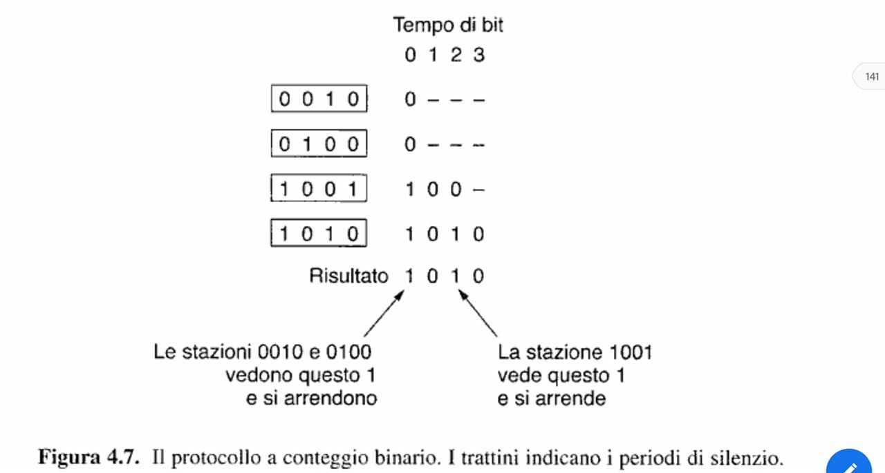
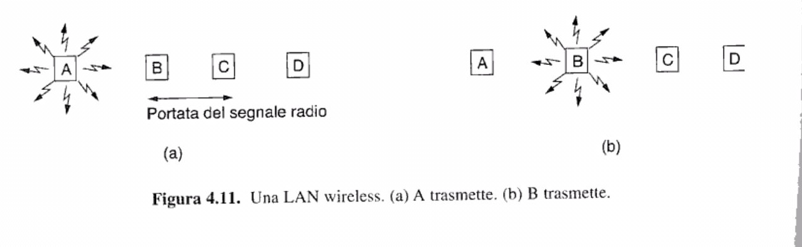
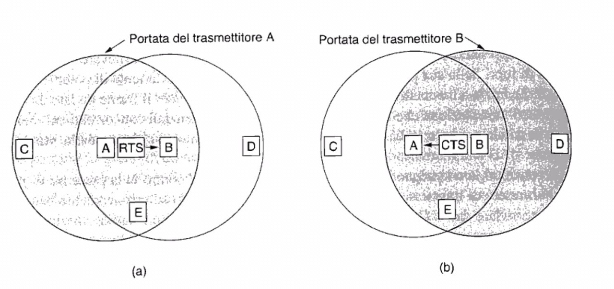
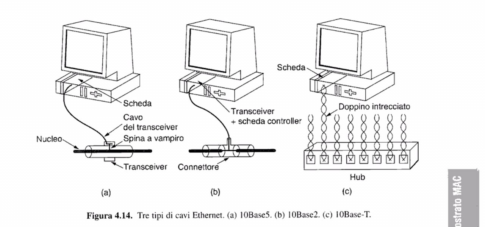

## Protocolli ad accesso multiplo  
Sono protocolli in cui vi e' competizione per le risorse, in soldoni, vi e' un unico canale condiviso da molti. I protocolli per assegnare l'uso di un canale multiaccesso appartengono a un sottostrato dello strato collegamento dati, chiamato **MAC** (*Medium Access Control* ). I sistemi a competizione sono utili quando il traffico sulla rete e' irregolare ( praticamente sempre ), se ad esempio utilizzassimo FDM (o TDM) per la trasmissione sullo stesso canale di piu' utenti, presupponendo di aver diviso lo spettro in N regioni, nel caso ci fossero meno di N utenti a trasmettere stiamo sprecando banda, nel caso ci fosser piu' di N utenti a trasmettere allora parte di essi non sarebbero in grado di trasmettere.  
**Premesse**:  
1. Modello della stazione => vi sono N stazioni indipendenti, quando una stazione ha generato un frame, essa non fa nulla fino a che il frame e' stato spedito con successo.  
1. Presupposto del canale => Un solo canale viene utilizzato per tutte le trasmissioni.  
1. Presupposto della collisione => se due frame si sovrappingono ( anche parzialmente ) entrambi i fram sono distrutti.  
1. Tempo continuo => non vi e' un orologio centralizzato che scandisce i tempi per la trasmissione, chiunque puo' rasmettere appena ha frae da inviare.  
   Tempo diviso in slot=> vi e' un orologio centralizzato che scandisce i tempi ( la suddivisione in slot ) per la trasmissione, la trasmissione di un frame coincide con l'inizio dell'intervallo  
1. carrier sensitive => Una stazione  puo' verificare se il canale e' in uso oppure no.  
   non carrier sensitive => Una stazione non puo' cvapire se il canale e' in uso oppure no.  
### Aloha  puro  
L'idea di fondo è: quando una stazione ha qualcosa da trasmettere, trasmette, senza preoccuparsi delle conseguenze (quindi senza ascoltare il canale prima di trasmettere). Una stazione può accorgersi ascoltando il canale se la comunicazione è andata a buon fine. Se il pacchetto collide, la stazione rimane in attesa per un tempo casuale prima di trasmettere.  
**Qual è la probabilità che ci sia qualcun altro nella linea che strasmettere, compromettendo quindi entrambi i paccheti trasmessi?**    
Presupponiamo che vengano generati N frame per tempo di frame (tempo di trasmissione di un frame (s/c)). Se N>1 si stanno generando una quantità di frame che il canale non è in grado di gestire, data la troppa frequenza con cui vengono generati, assumiamo quindi 0<N<1.  
Le stazioni dovranno ristrasmettere i frame che hanno colliso, suponiamo una probabilità di k tentativi per tempo di frame, con una media di G frame per tempo di frame.  
La probabilità che k frame siano generati in un periodo di tempo t è: `Pr[k] = ((G^k)e^-G)/k!`, perciò la probabiltà che non vengano generati altri frame durante il perido t è `e^-G`.    
In un intervallo lungo due tempi di frame (2t), la media dei frame generati per tempo di frame è pari a 2G. Il periodo di vulnerabilità del nostro frame è tra t0 a t0+2t, la probabilità che in questo intervallo non vengano generati altri frame è pari a `e^-2G`.  
La capacità di trasporto massima si ha con G=0.5 => sostituendo G alla formula trovo che la probabilità che le cose vadano bene per il mio frame sono del 18,4%. La cosa che alletta però è la scbilità del sistema, nella formula non compare infatti la quantità di terminali che trasmettono, il 18,4% rimane così costante all'aumentare dei dispositivi che si aggiungono alla rete.  
**NB** => si è notato che utilizzando in Aloha pacchetti di lunghezza fissa si hanno generalmente prestazioni migliori.  
### Aloha slotted  
Con Aloha slotted si ha un orologio sincronizzato centralmente che ci indica quando si può cominciare a trasmettere. Possiamo così avere sovrapposizioi di pacchetti solo nel caso in cui ci fossero atri pacchetti nello slot in cui vogliamo trasmettere. Quindi, il tempo di vulnerabilità è dimezzato, viene così raddoppiata la probabilità di una trasmissione a buon fine, in formula: `Ge^-G` ( dove G è la media dei frame generati in un tempo di frame, ed e^-G è la probabilità di successo), arrivando così al 36,8%. Aloha slotted ha una capacita' massim con `G=1`.  
**aloha a confronto**:  

**NB** => entrambi i protocolli visti fino ad ora **non possiedono il carrier sensitive**.  
**CSMA** => carrier sensistive multiple access.  
### 1-Persistente CSMA  
Quando una stazione ha un frama da trasettere, per prima cosa ascolta il canale per capire se qualcun altro sta trasmettendo in quel momento; se il canale è occupato, la stazione aspetta fin che non si libera; una volta che il canale è libero, la stazione comincia a trasmettere. In caso di collisione, la stazione aspetta un tempo casuale prima di cominciare a trasmettere. 1 persistant perchè spediamo i pacchetti il 100% delle volte. La probabilità che un frame venga inviato correttamente è più del 50%.  
**Problema** => può essere che ad un certo momento tutte le stazioni stiano aspettando che il canale di liberi per trasmttere un frame. In tal caso tutti i frame verranno distrutti. Il motivo alla base di tale comportamento è che tramite l'attesa stiamo creando sincronizzazione.  
### CSMA non persistente  
Prima di trasmettere ogni stazione controlla il canale (come prima), se il canale è occupato non eseguo un controllo continuo fino a quando il canale si libera, ma aspetta un tempo casuale e poi ricontrolla il canale.  
### CSMA p-Persistente  
Una stazione rimane in ascolto del canale fino a quando non si libera ( infatti è persistente ) e poi trasmette i frame con probabilità **p**. In caso di collisione si attende un intervallo di tempo casuale.  
**Sunto tramite grafico delle prestazioni**  

### CSMA/CD  
CSMA con *Collision Detection*, le stazioni possono accorgersi che vi è stato una collisione, e al posto di continuare a trasmettere frame che verranno da li a poco distrutti, interrompono la trasmissione, e dovranno aspettare un tempo casuale prima di ritrasmettere. CSMA/CD è alla base delle comunicazioni Ethernet in LAN.  
**Funzionamento**  
Supponiamo sia *t* il tempo che il segnale impiega a propagarsi tra le due stazioni piu' distanti. All'istante *t0* una stazione A comincia a trasmettere, e all'istante *t-e* la stazione B comincia a trasmettere ( quest'ultima non aveva ovviamente rilevato la trasmissione perche' il senale doveva ancora propagarsi a quest'ultima). La stazione B rileva quasi immediatamente l'errore, ma la stazione A impieghera' un tempo *2t-e* a capire che e' avvenuta una collisione, perche' il picco di rumore deve propagarsi all'indietro. Il rilevamento della collisione e' un sistema analogico, e' facile capire che CSMA/CD su singolo canale e' intrinsicamente half duplex, e' impossibile quindi per una stazione trasmettere e ricevere nello stesso momento, dato che durante la trasmissione vi e' attiva la logica che cerca di rilevare le collisioni.  
**NB**: il sottostrato MAC non garantisce una consegna affidabile.  
### Protocolli senza collisione  
Con CSMA/CD le collisioni possono avvenire solo durante il periodo di contesa.  
Esaminiamo alcuni protocolli che non generano **MAI** collisioni:  
#### Protocollo a mappa di bit  
Con N stazioni, dividiamo il perido di contesa in N slot. Una stazione j puo' annunciare la volonta' di trasmettere solo all'interno dello slot j, trasmettendo un 1; nessun altro potra' trasmettere durante quel periodo. Una volta trascosi gli N intervalli ogni stazione sa quali stazioni devono trasmettere, e a questo punto le stazioni inizieranno a trasmettere in ordine numerico.  
  
Con basso carico la mappa di bit ripetera' il ciclo di controllo di stazioni pronte di continuo. A basso carico, una stazione "con valore numerico basso", di solito, prima che possa essere pronta, lo slot corrente sara' da qualche parte in mezzo alla mappa di bit, trascorreranno quindi N/2 sot, e altri N prima che possa trasmettere. Una stazione con  "con valore numerico alto", trascorrera' in media solo N/2 prima di trasmettere. se d sono i bit da trasmettere, in media una stazione aspettera' N slot per trasmettere (N bit trasmessi), con un'efficienza di `d/(d+N)` a carico basso. A carico alto l'efficienza e' di `d/(d+1)`  
#### Conteggio binario  
Con la mappa di bit si ha un overhead di 1 bit per stazione, il che lo rende poco scalabile quando si cominciano ad avere migliaia di stazioni. Nel conteggio binario una stazione che desidera trasmettere deve prima comunicare il proprio indirizz binario a tutte le stazioni a partire dal valore con peso maggiore. I bit nella stessa posizione di indirizzi diversi sono elaborati tramite l'OR. Trascurando i tempi di ritardo, appena una stazione si accorge che e' stata sovrascritta da un 1 in una posizione in cui essa aveva uno 0, si toglie dalla contesa.
 
efficienza: `d/(d+log2(N))`  
### Protocolli a contesa limitata  
Ogni stratefia di acquisizione del canale puo' essere valutata guardando il ritardo a basso carico, e l'efficienza a carico elevato. Esempio: a carico basso Aloha funziona bene per il basso ritardo, ma all'aumentare del carico la contesa diventa inefficiente. Con i protocolli senza collisione avviene il contrario. I protocolli a contesa limitata cercano di mettere insieme le proprieta' migliori dei protocolli che abbiamo visto. 
#### Protocollo adaptive tree walk  
Nel primo intervallo di contesa che segue una trasmissione andata a buon fine, l-intervallo 0, tutte le stazioni provano ad acquisire il canale. Se una stazione riesce, bene, altrimenti, in caso di collisione, durante l'intervallo 1 possono competere solo le stazioni sotto il nodo 2. Se una delle stazioni sotto il nodo 2 acquisisce il canale, l'intervallo sucessivo viene riservato alle stazioni sotto il nodo 3, perche' non essendoci state collissioni sotto il nodo 2, non vi erano altre stazini che dovevano trasmettere. Se ci fosse stata una collisione, l'intervallo sucessivo sarebbe stato riservato al nodo 4. In generale, in caso di collisione la ricerca continua in modo ricorsivo analizzando i figli del nodo corrente. Con carico elevato non ha senso analizzare il nodo uno ( sarebbe come utilizzare un Aloha con un carico pesante ). Si noti che ogni nodo a livello i ha una frazione dei nodi totali pari a `2^-i`, se q sono le stazioni allora si hanno `(2^-i*q)`; il livello ottimale da cui far partire la ricerca e' quando  si hanno un numero di stazioni in contesa pari a 1, quindi quando `(2^-i*q) = 1` => `i=log2(q)`.  

### Protocolli LAN Wireless  
**Problema della stazione nascosta**  
A e B si vedono, potenzialmente i loro segnali possono iterferire, C puo' interferire con B e D ma non con A. Ora A trasmette a B, C non puo' rilevare la portante di A perche' non la vede, pensa erroneamente che B sia libero e trasmette, creando cosi conflitto.  
**Problema della stazione esposta**  
B trasmette ad A, C rileva una portante nel mezzo trasmissivo, pensa erroneamente di non poter inviare a D.  

#### Protocollo MACA (Multiple Accesswith Collision Avoidense  
A vuole trasmettere a B, A invia un frame RTS (request to send) a B, questo frame contiene la lunghezza del frame da dati che si vuole inviare. B risponde con un frame CTS (clear to send), che contiene il carico di RTS (quidi la lunghezza del frame dati). Non appena A riceve il frame CTS comicia a trasmetere. C vede A ma non B, quindi riceve il frame RTS ma non CTS inviato da B, fintanto che non interferisce con CTS C puo' trasmettere, ma D, che riceve solo l'RTS, sa di essere vicino ad una stazione che sta per ricevere un frame, quindi sta zitto, e tramite la lunghezza del pacchetto che trova in RTS puo' far una stima del tempo di attesa.  

#### Protocollo MACAW  
E' MACA con CSMA (quindi con rilevameno della portante) e con ACK.  
### Ethernet  
IEEE ha standardizzato LAN e MAN sotto 802. Gli standard piu' importanti sono: 802.3 per Ethernet, 802.11 per LAN wireless, 802.16 per MAN wireless e 802.15 Bluetooth. 

I transceiver contegono l'elettronica per rilevare la portante ( ascoltare il canale trasmissivo ) e rilevare le collisioni. 
