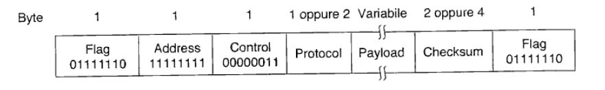

# Protocolli livello datalink  
## Protocollo stop-and-wait  
Come dal nome, il **sender** aspetta l'ack di conferma del pacchetto prima di mandarne un altro al receiver.  
Quindi basta un canale half duplex, in quanto in un dato momento solo il **sender** (con un pacchetto dati), o il **receiver** (con ack di conferma ) spediscono attraverso il canale.  
**Problemi**:  
1)Senza un controllo di flusso il **sender** potrebbe sommergere il **receiver** di pacchetti, provocando la perdita di quest'ultimi. **Soluzione** => dopo aver passato il pacchetto allo strato network il **receiver** spedisce un piccolo frame senza dati (dummy) (in questo caaso l'ack), che dal al **sender** il permesso di inviare il frame sucessivo. Il **sender** è obbligato dal protocollo ad aspettare fino all'arrivo dell'ack.  
2)Procedendo in questo modo se l' **ack** di un qualsiasi frame viene perso, il **receiver** rimarrebbe potenzialmente fermo per sempre. **Soluzione** => introduciamo un **Timeout** (concetto locale che risolve un concetto globale). Quindi, se entro un tot non si riceve un ack dal **receiver**, il **sender** rispedisce il pacchetto.  
3)Nel caso precedente senza un controllo della sequenzialità del pacchetto, il **receiver** non si accorgerebbe che ha tra le mani un pacchetto duplicato, **Soluzione** => dato che la possibile ambiguità sta tra il frame m e m+1, un solo bit sarà sufficiente.  
Esempi di questo tipo di protocolli sono il **PAR** e l' **ARQ**.  
## Funzionamento generale:  
Dopo la trasmissione del frame il **sender** avvia il timer, se il timer era già stto avviato viene resettato e fatto ripartire. L'intervallo di tempo deve essere scelto in modo che il **frame** abbia il tempo di arrivare al **sender**, essere elaborato, e infine il frame di **ack** deve avere il tempo di tornare indietro. Dopo aver spedito un frame la sorgente aspetta che accada qualcosa: possono avvenire tre cose:  
1. Arriva un frame di ack intatto => il **sender** prende un nuovo pacchetto dallo strato network e lo mette nel buffer.
1. Arriva un frame di ack con errori => nel buffer rimane il frame precendente, non viene cambiato il numero di sequenza e viene lancoato un duplicato  
1. Non arriva ack e scatta il **Timer** => nel buffer rimane il frame precendente, non viene cambiato il numero di sequenza e viene lancoato un duplicato  
### Problema generale dello stop and wait:  
se **bandwidth*round-trip-delay** è grande, significa che stiamo sottoutilizzando la banda; ed è proprio quello che avviene con questo protocollo.  
## Calcolo utilizzo linea  
**Capacità** c (bit/s)  
**Taglia frame** s (bits)  
**Round trip** r ( tempo impiegato da un pacchetto perarrivare a destinazione e ack arrivi al sender)  
**Utilizzo linea**= `s/(s+c*r)`  
`c*r` sono i dati che potevano essere trasmessi  
## Piggybacking  
In tutto questo possiamo notare un problema: ogni frame genera un altro frame, stiamo quindi dimezzando la banda.  
Il **receiver** quando riceve un frame dati, non invia immediatamente un frame di ack, ma aspetta che lo strato network gli passi un altro pacchetto, l'ack viene quindi aggiunto al frame dati in uscita, utilizzando un campo ack nell'header del frame. Questo campo ack non occuperà più di qualche bit, mentre costruire un intero frame separato richiederebbe un'intestazione, un ack e un checksum. E' ovvio che se un pacchetto dallo strato network arriva velocemente al **receiver**, questo potrà utilizzarlo per inviare anche l'ack, in caso contrario l'ack verrà spedito da solo. Il **Timer** dovrà tenere conto di questa "miglioria".  
## Protocolli sliding window  
L'idea e' quella di avere una finestra circolare di n spichi a cui si accede a m spicchi con m<=n, a ognuno di questi e' assegnato un pacchetto da spedire, quando ricevo l'ack relativo a quello spicchio lo libero e se anche gli spicchi precedenti si son loberati, sposto la finestra a quello sucessivo  Anche il ricevitore deve essere pronto per l'arrivo di più pacchetti. Il ricevente tiene aperta una finestra per sugli spicchi che sta aspettando, quando il pacchetto arriva invia l'ack corrispondente. Se gli spicchi precedenti della finestra sono stati ricevuti sposto l'inizio della finestra allo spicchio successivo. Due numeri importanti: l'ampiezza complessiva della finestra(n), e il grado di parallelismo(m) (Quanti pacchetti invio contemporaneamente) grado <= ampiezza
In questi protocolli, il **sender** tiene traccia di un insieme di frame che è autorizzato ad inviare ( cioè che sono nella **finestra di invio** ), e il **receiver** mantiene una **finestra di ricezione**, che corrisponde all'insieme dei frame che può accettare. Ogni frame in uscita contiene un **numero di sequenza** da 0 ad una potenza di 2 (per motivi implementativi). I frame trasmessi dal **sender** sono mantenuti in un buffer nell'eventualit' alcuni andassero persi.  
### Protocollo GoBackN  
Con questo protocollo nel caso di errori durante la trasmissione, il **receiver** scarta tutti i frame sucessivi all'errore, ma continua a trasmettere ack (anche con piggybacking) dell'ultimo frame arrivato con successo. Questo comportamento corrisponde ad una finestra di ricezione pari a **1**. Puo' succedere che ad un certo punto la finestra del **sender** si saturi, quando ( e se ) la sorgente va in timeout, rispedira' tutti i frame a partire dal primo danneggiato o perso. Metodo vantaggioso se avvengono **pochi errori**, **bandwidth*round-trip-delay alto**.
### Ripetizione selettiva  
Con questo metodo i frame in errore vengono scartati, ma vengono mantenuti i frame buoni in un buffer. Per in frame in errore vengono mandati NAK ( cioe' ack negativi ), che sollecitano il **sender** a spedire i frame in errore prima del timeout. La ripetizione selettiva corrisponde ad avere una finestra di ricezione **maggiore di 1**. Nel caso di **timeout** solo il frame più vecchio senza ack viene ritrasmesso. (guardare esempio su libro o in caso riortarlo qui)  
**Problema**=> Suppponiamo che durante una trasmissione tutti i pacchetti arrivino al destinatario correttamente, ma ( ad esempio per un forte evento atmosferico ), tutti gli ack vengano persi. La destinazione avra' (come conseguenza alla corretta ricezione ) spostato la finestra di ricezione, aspettandosi cosi la stessa sequenza di frame ( cioe' stessi numeri di sequenza), il timer della sorgente scatta, dato che nessun ack e' stato rilevato; accade che la destinazione accetta tutti i frame in entrata, non accrogendosi che sono duplicati. Il problema e' quindi una sovrapposizione delle finestre. **Soluzione**=>  la dimensione della finestra dovrebbe essere la **metà** della sequenza di numeri. Se abbiamo 3 bit per la sequenza dei frame (quindi una numerazione da 0 a 7), la finestra deve essere al massimo grande 4.  
<!-- parte di Leonardo da aggiungere -->  
### Protocollo PPP  
Protocollo **punto-punto** utilizzato per il traffico **router-router** e **momdem-isp**.  
**nota**: nel protocollo PPP sono utilizzati altri due protocolli:  
1. **LCP** => *link control protocol* che viene utilizzato per gestire la connessione, il test della linea, negoziare i parametri di collegamento ( quali ad esempio l'omissione del campo *control* e *address* nel frame, dato che di solito di default "non vengono utilizzati perche' usano valori nulli", e vengono settati solo in caso di canali rumorosi, ma anche settare la grandezza del *payload*, dato che in PPP e' variabile, puo' essere settato lo spazio attribuito al checksum, se usare ad esempio 2 o 4 byte e negoziare la lunghezza di *Protocol*, se 2 o 1 byte) e gestire la disconnessione in modo pulito.  
2. **NCP** => viene utilizzato per negoziare le opzioni dello strato network.  
È stato ideato per essere il più simile possibile a HDLC. PPP delimita i suoi frame con byte stuffing,
non con bit stuffing come HDLC.  

**frame PPP**:  
      

Nel campo *Protocol* si specifica a che protocollo si riferisce il frame inviato (LCP o NCP, ecco perché è definito meta-protocollo). I frame del protocollo LCP iniziano col bit 1, gli altri con il bit 0.  
Nel campo *Payload* sono contenuti i dati: la dimensione di questo campo può variare, in base al protocollo utilizzato.  
Nel campo *Checksum* è contenuto il codice di rilevazione degli errori, calcolato con CRC.  
I campi *Address* e *Control* hanno dei valori default che si notano nell'immagine. Address impostato in questo modo indica a tutte le stazioni di accettare il frame. Control e' utilizzato per la numerazione dei frame, con l'impostazione di defaul non vi e' nessuna indicazione di valore, di fatto si utilizza la numerazione (e campo Address) solo in caso di canali rumorosi.  

### PPP e le ADSL  
All’interno di una rete è possibile decidere la dimensione di un frame, impostando il valore MTU (Maximum Transmission Unit). Esiste comunque una dimensione prefissata dell’MTU ed è decisa nello standard di PPP.  
Si potrebbe tenere un valore alto per l’MTU e si avrebbero quindi frame più grandi: si otterrebbe
come risultato meno overhead e quindi più banda disponibile (andrebbe bene in canali affidabili).  
Si potrebbe tenere un valore basso per l’MTU e si avrebbero quindi frame più piccoli: si otterrebbe
come risultato più overhead e quindi meno banda disponibile (andrebbe bene in canali poco
affidabili).  
Queste due affermazioni però non sono sempre vere, poiché le reti non sono isolate, devono
interfacciarsi con altre e quindi la modifica dell’MTU potrebbe portare benefici solo nella propria rete,
ma al di fuori di questa le cose si complicano parecchio.  
Per collegare le varie reti, PPP viene istanziato in due varianti:  
• **PPPoA (PPP over ATM)**;  
• **PPPoE (PPP over Ethernet)**.  
Una versione (molto semplificata) dei passi che avvengono quando un computer si connette a Internet:  
1. computer-router  
2. router-modem  
3. modem-DSLAM (usato per il mutiplexing)  
4. DSLAM a provider  
5. da provider a internet  

Per ogni passo, c’è un cambio di protocollo. Ad esempio, quando si passa al provider non si è arrivati in fondo: possono esserci più reti cablate assieme, ma di tipo diverso. Solitamente, il primo tratto è ATM, il secondo è Ethernet. ATM (Asynchronous Transfer Mode) è un’evoluzione di HDLC, usa TDM e gestisce il flusso con una sliding window (con apertura 16), rilevazione degli errori con CRC8 e indirizzamento di due tipi gerarchici:  
• **cammini (path)** (nei modem, identificati con il campo Virtual Path Identifier, VPI);  
• **canali (channels)** (nei modem, identificati con il campo Virtual Channel Identifier, VCI).  
**ATM** è connection-oriented, ecco il perché dei Virtual Channel.  
Una **connessione ADSL** inizia nel seguente modo:  
• il computer/modem invia un frame **PPPoE (Active Discovery Initiation)**, col suo indirizzo fisico (MAC);  
• i servizi ADSL disponibili rispondono con un **PADO (PPPoE Active Discovery Offer)**;  
• il computer/modem risponde con un **PADR (PPPoE Active Discovery Request)** in cui segnala il servizio ADSL che ha scelto  
• il servizio fa l'ACK usando un frame **PADS (PPPoE Active Discovery Sessionconfirmation)**;  
• la connessione è terminata da un frame **PADT (PPPoE Active Discovery Termination)**.  
